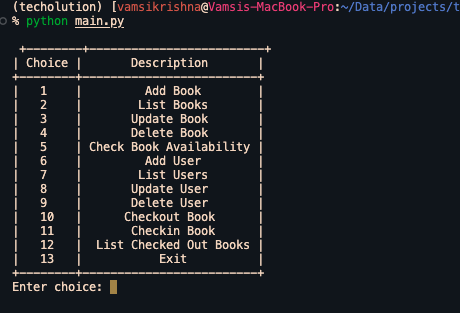
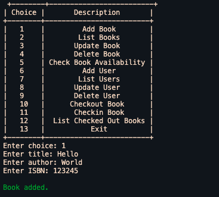
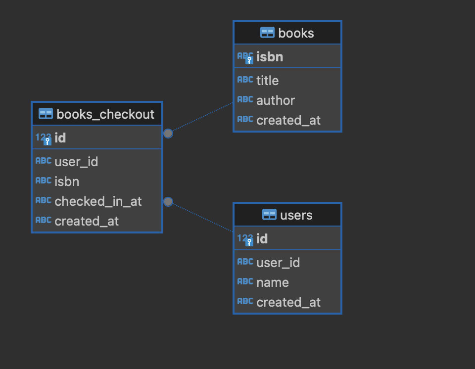

# Redesigning Poor Code

## Problem Statement
Your task is to reformat a poorly designed code for a Library Management System with the following functionalities
1. Manage books (add, update, delete, list, and search by various attributes like title, author, or ISBN)
2. Manage users (add, update, delete, list, and search by attributes like name, user ID)
3. Check out and check-in books
4. Track book availability
5. Simple logging of operations

### Task for the Candidate
1. The application should utilize classes and objects more effectively, with clear relationships and responsibilities among them with Object Oriented Design.
2. Implement or refactor the storage.py for reliable storage and retrieval using file-based storage (JSON, CSV, etc.)
3. Obtain input from the user using CLI to access information from the user in a friendly and intuitive manner.
4. Implement error handling and input validation throughout the application.
5. The application's design doesn't facilitate easy extension or modification.
6. Ensure that the application is modular and scalable, allowing for future expansions such as new types of items to manage or additional features like due dates for books, late fees, etc.
7. Include document action and comments to explain the design decisions, architecture, and usage of classes and methods.

## Solution

Code folder structure:
```
.
├── README.md
├── book.py
├── check.py
├── library.db
├── main.py
├── requirements.txt
├── storage.py
├── user.py
└── utils.py
```
### How to run the code
1. Clone the repository
2. Install the requirements using `pip install -r requirements.txt`
3. Run the code using `python main.py`
4. Follow the instructions on the terminal to use the application <br>
#### Example Usage:

1. You can select the options from the menu to perform the operations
2. 
3. Below is the example of adding a book
4. 
5. Here, you can follow rest of the options to perform the operations.

### Schema Design
1. The application uses a file-based SQL storage system to store the data in a SQLite database.
2. The database has three tables, `books`, `users`, `books_checkout` to store the book, user and check-out and check-in information respectively.
#### Schema Diagram


### Design Decisions
1. The application uses classes and objects to represent the entities like `BooksManager`, `UserManager`, `BooksCheckoutManager` and `Storage`.
2. The `Storage` class is responsible for handling the storage and retrieval of data from the database, and creating connections to the database.
3. The `BooksManager`, `UserManager`, `BooksCheckoutManager` classes are responsible for handling the operations related to books, users and check-in and check-out of books respectively.
4. The `main.py` file is the entry point of the application and is responsible for obtaining input from the user and calling the appropriate methods from the `BooksManager`, `UserManager`, `BooksCheckoutManager` classes.
5. The `utils.py` file contains the utility functions like `get_input`, `get_int_input`, `get_date_input` etc. to obtain input from the user and perform input validation.
6. The `book.py` and `user.py` files contain the classes to manage the `BooksManager` and `UserManager` entities respectively.
7. The SQLite database name is defaulted to `library.db` and can be changed in the `main.py` file.

### Future Scope
1. The application can be extended to include features like due dates for books, late fees, etc.
2. The application can be extended to include additional features like tracking the history of check-in and check-out of books, tracking the history of user activities, etc.
3. The application can validate new fields by just writing and new validation function and adding it to the `utils.py` file.

### Conclusion
The application has been redesigned to use classes and objects more effectively, with clear relationships and responsibilities among them with Object Oriented Design. The application uses file-based storage for reliable storage and retrieval using a SQLite database. The application obtains input from the user using CLI to access information from the user in a friendly and intuitive manner. The application implements error handling and input validation throughout the application. The application's design facilitates easy extension or modification and is modular and scalable, allowing for future expansions such as new types of items to manage or additional features like due dates for books, late fees, etc. The application includes document action and comments to explain the design decisions, architecture, and usage of classes and methods.
